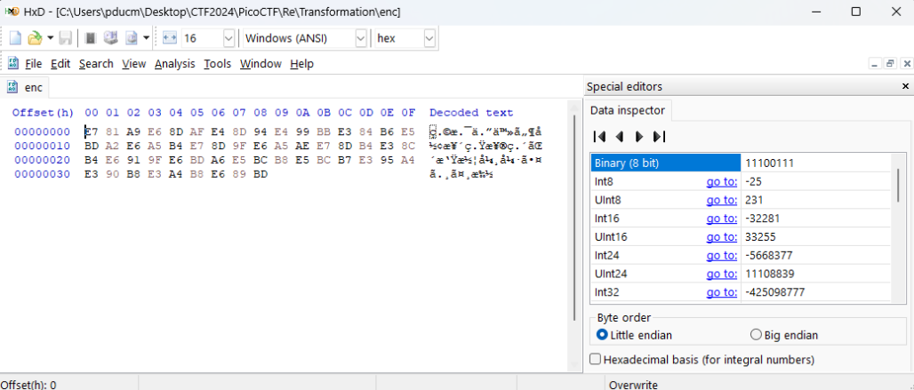
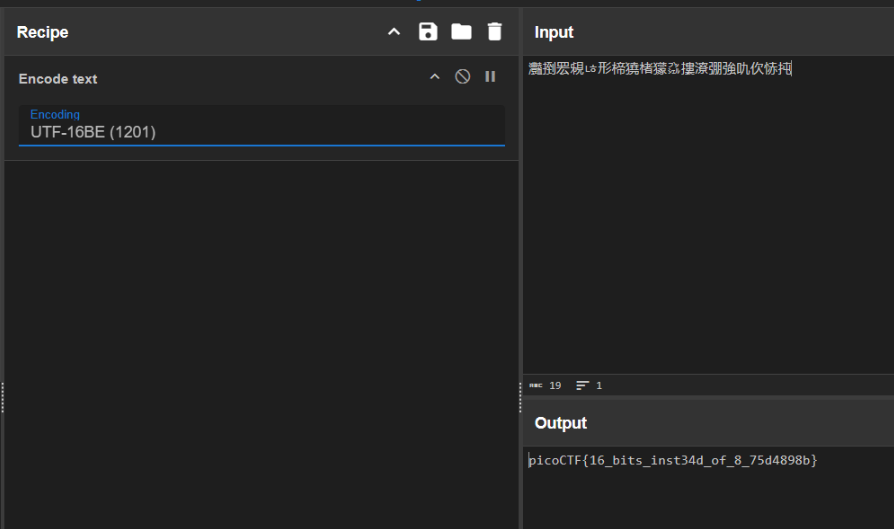
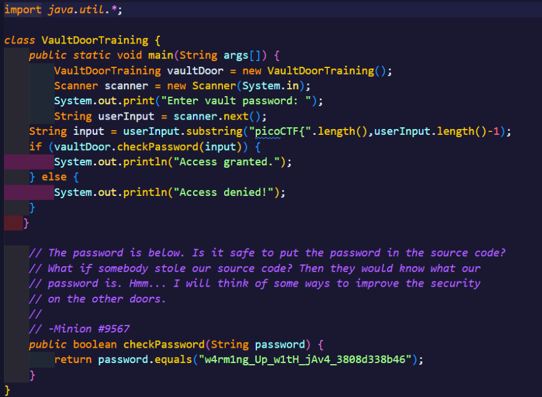
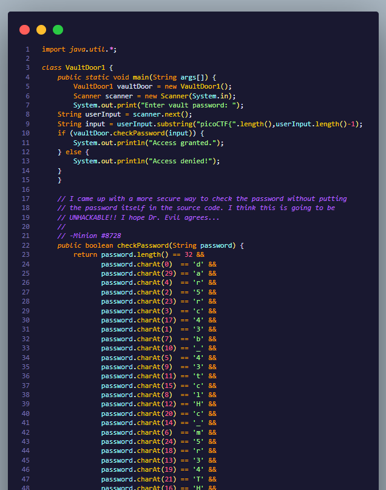
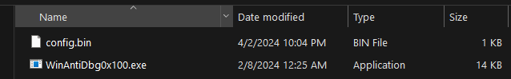
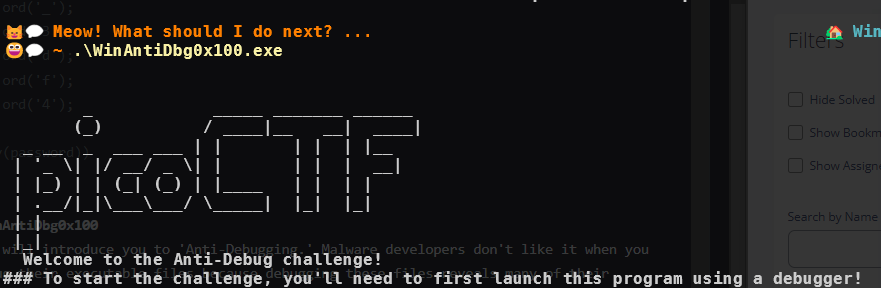
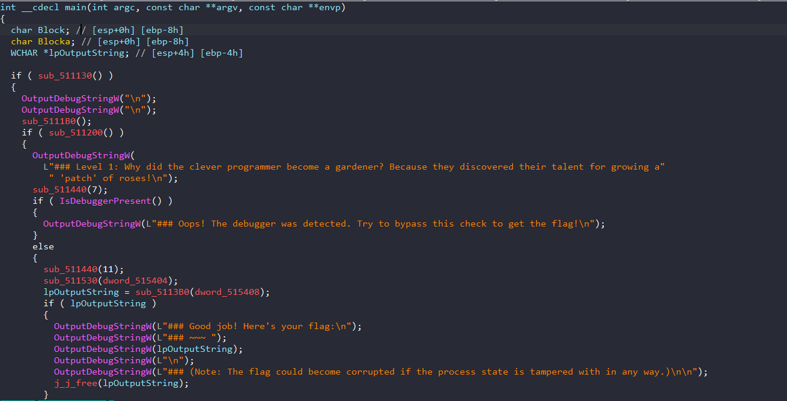
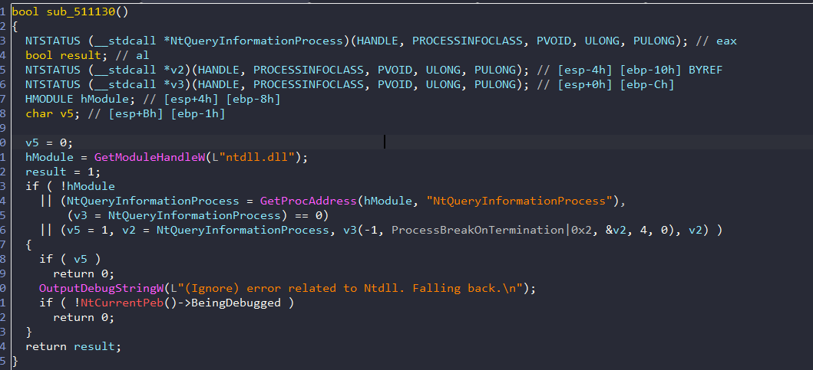

# PicoCTF-WriteUp-Reverse

## Easy - Transformation
### Description
```
I wonder what this really is... enc ''.join([chr((ord(flag[i]) << 8) + ord(flag[i + 1])) for i in range(0, len(flag), 2)])
```

Bài cho một file **enc** có nội dung như sau



Cái đoạn trong miêu tả kia là cách mã hóa bằng cách xử lý 2 ký tự một của flag theo các bước sau:
- Đổi các ký tự sang giá trị ASCII
- Ký tự đầu sẽ được dịch trái 8 bit sau đó cộng với ký tự thứ 2
- Sau đó chuyển kết quả thành char và lưu vào string
sau đó sẽ ghi cái string thu được vào enc, cơ bản thì nó đang cố decode flag , ta chỉ việc encode là xong. Có thể sử dụng cyberchef hoặc script dưới đây



```
ct = "灩捯䍔䙻ㄶ形楴獟楮獴㌴摟潦弸強㕤㐸㤸扽"
print(ct.encode('utf-16-be'))
```

## Easy - vault-door-training
Bài cho một file code java với cờ bên trong 



## Medium - vault-door-1
### Description
This vault uses some complicated arrays! I hope you can make sense of it, special agent. The source code for this vault is here: VaultDoor1.java



Cơ bản thì cũng không khó lắm khi mà ta có thể nhờ Chat-GPT sắp xếp trong một nốt nhạc hoặc sửa lại mã để in ra password khi check
```
password = [ord('a') for i in range(32)]

password[0] = ord('d');
password[29] = ord('a');
password[4] = ord('r');
password[2] = ord('5');
password[23] = ord('r');
password[3] = ord('c');
password[17] = ord('4');
password[1] = ord('3');
password[7] = ord('b');
password[10] = ord('_');
password[5] = ord('4');
password[9] = ord('3');
password[11] = ord('t');
password[15] = ord('c');
password[8] = ord('l');
password[12] = ord('H');
password[20] = ord('c');
password[14] = ord('_');
password[6] = ord('m');
password[24] = ord('5');
password[18] = ord('r');
password[13] = ord('3');
password[19] = ord('4');
password[21] = ord('T');
password[16] = ord('H');
password[27] = ord('6');
password[30] = ord('f');
password[25] = ord('_');
password[22] = ord('3');
password[28] = ord('d');
password[26] = ord('f');
password[31] = ord('4');

print(bytearray(password))
```

## Medium - WinAntiDbg0x100
This challenge will introduce you to 'Anti-Debugging.' Malware developers don't like it when you attempt to debug their executable files because debugging these files reveals many of their secrets! That's why, they include a lot of code logic specifically designed to interfere with your debugging process.
Now that you've understood the context, go ahead and debug this Windows executable!
This challenge binary file is a Windows console application and you can start with running it using cmd on Windows.

Bài cho 2 file 



Khi chạy nhận được kết quả như sau:



Mình tiến hành debug và đọc hàm main như sau từ IDA



Cơ bản thì bài này sử dụng tổng hợp các kỹ thuật anti debug và nếu mình debug được vào hàm **OutputDebugStringW(L"### Good job! Here's your flag:\n");** thì oke
Các hàm mình sẽ phải thỏa mãn là 
- sub_ab1130()
- sub_ab1200()
- IsDebuggerPresent()

Mình tiến hành check từng hàm một

#### sub_ab1130 và IsDebuggerPresent()


Hàm này sử dụng 2 kỹ thuật check debug bằng cách tra thông tin process có đang bị debug bằng hàm **NtQueryInformationProcess** và PEB của PE32
Cách xử lý nhanh là mình patch 2 lệnh **jnz** thành **jz** là oke
Cách xử lý tương tự với hàm IsDebuggerPresent()



#### sub_ab1200()

```
int sub_191200()
{
  char FileName[260]; // [esp+0h] [ebp-21Ch] BYREF
  CHAR Filename[260]; // [esp+104h] [ebp-118h] BYREF
  int v3; // [esp+208h] [ebp-14h]
  _BYTE *v4; // [esp+20Ch] [ebp-10h]
  unsigned int i; // [esp+210h] [ebp-Ch]
  size_t v6; // [esp+214h] [ebp-8h]
  FILE *Stream; // [esp+218h] [ebp-4h]

  GetModuleFileNameA(0, Filename, 0x104u);
  v4 = sub_191000(Filename, 92);
  if ( v4 )
    *v4 = 0;
  snprintf(FileName, 0x104u, "%s\\config.bin", Filename);
  Block = malloc(0xC8u);
  if ( !Block )
    return 0;
  v3 = 0;
  Stream = fopen(FileName, "rb");
  if ( !Stream )
    return 0;
  v6 = fread(&dword_19540C, 1u, 4u, Stream);
  if ( v6 == 4 )
  {
    v6 = fread(Block, 1u, 0xC8u, Stream);
    if ( v6 && dword_19540C < 0xC8 && v6 == 2 * dword_19540C + 2 )
    {
      dword_195404 = Block;
      for ( i = 0; i < v6; ++i )
      {
        if ( i == dword_19540C && !dword_195408 )
          dword_195408 = Block + i + 1;
      }
      fclose(Stream);
      return 1;
    }
    else
    {
      free(Block);
      fclose(Stream);
      return 0;
    }
  }
  else
  {
    fclose(Stream);
    return 0;
  }
}
```
hàm này cơ bản chỉ là kiểm tra xem có đọc được file config.bin vào bộ nhớ không sau đó sẽ tạo địa chỉ của flag lại **dword_195408**
Debug qua IsDebuggerPresent() ta nhận được flag tại màn hình output

```
Debugged application message: ### Level 1: Why did the clever programmer become a gardener? Because they discovered their talent for growing a 'patch' of roses!

Debugged application message: ### Good job! Here's your flag:

Debugged application message: ### ~~~ 
Debugged application message: picoCTF{d3bug_f0r_th3_Win_0x100_e4a066b1}
```

## 