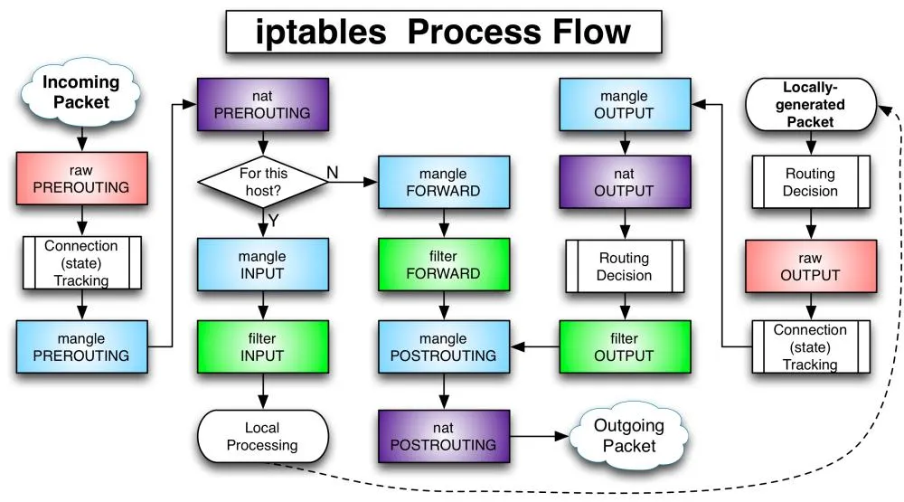

# IPTables và Docker – Bài học “đau thương” sau một lần tin nhầm INPUT

Lần đầu làm firewall cho server chạy Docker, tôi từng rất tự tin.

iptables mà, quá quen rồi.

Cho đến khi tôi nhận ra:  **Docker không chơi theo luật INPUT** .

## 1. Cú sốc đầu tiên: INPUT không có tác dụng

Kịch bản rất quen thuộc:

* Server chạy Docker
* Một container expose cổng 443
* Tôi chỉ muốn cho phép traffic từ load balancer nội bộ

Tôi viết rule quen tay:

```iptables
iptables -A INPUT -p tcp --dport 443 -s 172.16.0.0/26 -m state --state NEW,ESTABLISHED -j ACCEPT
iptables -A INPUT -j DROP
```

Test từ bên ngoài → **cổng vẫn mở** 😐

Lúc đó tôi nghĩ:

> “Chắc mình viết sai rule…”

Nhưng không.

Rule đúng, logic đúng,  **chỉ là nó không bao giờ được chạy** .


## 2. Docker và “ma trận” iptables

Đọc bài viết của Edouard Buschini, tôi mới vỡ ra một điều rất cơ bản mà trước đó  **chưa từng để ý nghiêm túc** :

> **iptables không chỉ có một bảng.**

Trước giờ tôi chỉ chăm chăm vào `filter` (INPUT / OUTPUT / FORWARD), nhưng Docker thì khác.

Docker  **can thiệp rất sâu vào bảng `nat`** , đặc biệt là:

* `nat PREROUTING`
* chain `DOCKER`
* DNAT trước khi packet kịp chạm INPUT

Nói cách khác:

👉  **Gói tin đã bị đổi đích sang IP container từ PREROUTING** ,

👉 nên  **INPUT của host không bao giờ thấy port 443 nữa** .

Đó là lý do:

* Bạn DROP INPUT vẫn không chặn được container
* Firewall “trông có vẻ đúng” nhưng thực tế vô dụng

## 3. Sai lầm phổ biến: cố gắng “đấu” với Docker

Sau khi hiểu vấn đề, tôi thấy rất nhiều giải pháp trên mạng kiểu:

* Tắt Docker quản lý iptables
* Ghi đè rule Docker mỗi lần restart
* Hack DOCKER-USER rồi cầu may

Thẳng thắn mà nói:  **đó là những giải pháp nguy hiểm** .

Docker quản lý iptables  **tốt hơn chúng ta tưởng** :

* Nó xử lý NAT
* Nó đảm bảo container hoạt động
* Nó không nên bị “đánh úp” bằng cách disable

Vấn đề không phải Docker sai.

Vấn đề là  **mình cần chặn ở đúng chỗ** .

## 4. Chặn ở NAT, không phải FILTER



Điểm tôi tâm đắc nhất từ bài viết là ý tưởng:

> **Muốn kiểm soát traffic vào container → phải can thiệp từ PREROUTING**

Giải pháp DOCKER-BLOCK rất “đẹp” về mặt kiến trúc:

* Không phá Docker
* Không disable iptables tự động
* Không động vào DOCKER chain gốc
* Chỉ “đứng trước cửa” và quyết định ai được đi tiếp

Luồng xử lý trở nên rõ ràng:

```
PREROUTING
  └─ DOCKER-BLOCK (deny all)
       └─ allow rule → DOCKER
```

Mặc định  **deny everything** ,

chỉ khi **explicit allow** thì mới cho Docker xử lý tiếp.

Ý tưởng cốt lõi  **không phải là “chặn bằng RETURN”** , mà là  **kiểm soát luồng xử lý trong `nat PREROUTING` trước khi Docker DNAT** .

### Bước 1: Tạo chain trung gian `DOCKER-BLOCK`

<pre class="overflow-visible! px-0!" data-start="439" data-end="482"><div class="contain-inline-size rounded-2xl corner-superellipse/1.1 relative bg-token-sidebar-surface-primary"><div class="sticky top-[calc(--spacing(9)+var(--header-height))] @w-xl/main:top-9"><div class="absolute end-0 bottom-0 flex h-9 items-center pe-2"><div class="bg-token-bg-elevated-secondary text-token-text-secondary flex items-center gap-4 rounded-sm px-2 font-sans text-xs"></div></div></div><div class="overflow-y-auto p-4" dir="ltr"><code class="whitespace-pre! language-bash"><span><span>iptables -t nat -N DOCKER-BLOCK
</span></span></code></div></div></pre>

Chain này đóng vai trò là **điểm kiểm soát trung tâm** cho toàn bộ traffic đi vào container.

---

### Bước 2: Gắn `DOCKER-BLOCK` vào đầu PREROUTING

<pre class="overflow-visible! px-0!" data-start="634" data-end="720"><div class="contain-inline-size rounded-2xl corner-superellipse/1.1 relative bg-token-sidebar-surface-primary"><div class="sticky top-[calc(--spacing(9)+var(--header-height))] @w-xl/main:top-9"><div class="absolute end-0 bottom-0 flex h-9 items-center pe-2"><div class="bg-token-bg-elevated-secondary text-token-text-secondary flex items-center gap-4 rounded-sm px-2 font-sans text-xs"></div></div></div><div class="overflow-y-auto p-4" dir="ltr"><code class="whitespace-pre! language-bash"><span><span>iptables -t nat -I PREROUTING -m addrtype --dst-type LOCAL -g DOCKER-BLOCK
</span></span></code></div></div></pre>

Ý nghĩa:

* Mọi packet có **đích là IP local của host**
* Đều **đi vào DOCKER-BLOCK trước**
* Sử dụng `-g` (GOTO) để sau khi `RETURN` sẽ  **quay lại PREROUTING** , không nhảy sang chain khác

---

### Bước 3: Trạng thái ban đầu – mặc định chặn kết nối mới

Ở thời điểm này, `DOCKER-BLOCK`  **chưa có rule nào** .

Hệ quả:

* Packet đi vào `DOCKER-BLOCK`
* Không match rule nào
* Kết thúc chain → implicit `RETURN`
* Quay lại PREROUTING **nhưng không đi qua Docker DNAT**

➡️  **Không có rule nào cho phép chuyển sang chain `DOCKER`** ,

➡️ nên  **Docker không thể DNAT traffic vào container** .

📌 **Đây chính là trạng thái “default deny”**

Luồng lúc này:

<pre class="overflow-visible! px-0!" data-start="1372" data-end="1489"><div class="contain-inline-size rounded-2xl corner-superellipse/1.1 relative bg-token-sidebar-surface-primary"><div class="sticky top-[calc(--spacing(9)+var(--header-height))] @w-xl/main:top-9"><div class="absolute end-0 bottom-0 flex h-9 items-center pe-2"><div class="bg-token-bg-elevated-secondary text-token-text-secondary flex items-center gap-4 rounded-sm px-2 font-sans text-xs"></div></div></div><div class="overflow-y-auto p-4" dir="ltr"><code class="whitespace-pre!"><span><span>PREROUTING
 └─ DOCKER-BLOCK
     └─ RETURN (implicit)
        └─ PREROUTING tiế</span><span>p</span><span> tục (không chạm Docker DNAT)
</span></span></code></div></div></pre>

---

### Bước 4: Cho phép từng dịch vụ cụ thể

Khi muốn mở cổng 443 cho container, ta  **explicit allow** :

<pre class="overflow-visible! px-0!" data-start="1598" data-end="1697"><div class="contain-inline-size rounded-2xl corner-superellipse/1.1 relative bg-token-sidebar-surface-primary"><div class="sticky top-[calc(--spacing(9)+var(--header-height))] @w-xl/main:top-9"><div class="absolute end-0 bottom-0 flex h-9 items-center pe-2"><div class="bg-token-bg-elevated-secondary text-token-text-secondary flex items-center gap-4 rounded-sm px-2 font-sans text-xs"></div></div></div><div class="overflow-y-auto p-4" dir="ltr"><code class="whitespace-pre! language-bash"><span><span>iptables -t nat -A DOCKER-BLOCK \
-p tcp --dport 443 \
-m state --state NEW \
-j DOCKER
</span></span></code></div></div></pre>

Ý nghĩa:

* Chỉ khi:
  * TCP
  * Port 443
  * Là kết nối mới
* Mới được **chuyển giao cho Docker xử lý DNAT**

---

### Bước 5: Luồng xử lý sau khi allow

Bây giờ luồng packet trở nên rõ ràng:

#### Với traffic được phép:

<pre class="overflow-visible! px-0!" data-start="1917" data-end="1989"><div class="contain-inline-size rounded-2xl corner-superellipse/1.1 relative bg-token-sidebar-surface-primary"><div class="sticky top-[calc(--spacing(9)+var(--header-height))] @w-xl/main:top-9"><div class="absolute end-0 bottom-0 flex h-9 items-center pe-2"><div class="bg-token-bg-elevated-secondary text-token-text-secondary flex items-center gap-4 rounded-sm px-2 font-sans text-xs"></div></div></div><div class="overflow-y-auto p-4" dir="ltr"><code class="whitespace-pre!"><span><span>PREROUTING
 └─ DOCKER-BLOCK
     └─ DOCKER (DNAT sang container)
</span></span></code></div></div></pre>

#### Với traffic không được phép:

<pre class="overflow-visible! px-0!" data-start="2025" data-end="2144"><div class="contain-inline-size rounded-2xl corner-superellipse/1.1 relative bg-token-sidebar-surface-primary"><div class="sticky top-[calc(--spacing(9)+var(--header-height))] @w-xl/main:top-9"><div class="absolute end-0 bottom-0 flex h-9 items-center pe-2"><div class="bg-token-bg-elevated-secondary text-token-text-secondary flex items-center gap-4 rounded-sm px-2 font-sans text-xs"></div></div></div><div class="overflow-y-auto p-4" dir="ltr"><code class="whitespace-pre!"><span><span>PREROUTING
 └─ DOCKER</span><span>-</span><span>BLOCK
     └─ RETURN
        └─ PREROUTING tiếp tụ</span><span>c</span><span></span><span>(</span><span>không DNAT → bị drop ở </span><span>c</span><span>á</span><span>c</span><span> bướ</span><span>c</span><span> sau</span><span>)</span><span>
</span></span></code></div></div></pre>

👉 **Docker chỉ được gọi khi firewall cho phép**

👉 Không có chuyện “vượt qua Docker”, mà là **chủ động trao quyền cho Docker**

## 5. Một bài học khác: reload firewall không được làm gián đoạn hệ thống

Một điểm rất thực tế mà bài viết đề cập (và tôi từng dính):

* Reload iptables có thể:
  * Làm rớt SSH
  * Cắt kết nối đang chạy
  * Tạo cửa sổ “trống firewall” vài mili giây

Script của Edouard xử lý rất cẩn thận:

* Chỉ block NEW connection
* Giữ ESTABLISHED connection
* Không tạo race condition với Docker
* Không để rule bị nhân đôi sau mỗi lần chạy

Đây là kiểu script:

> “Không chỉ chạy được, mà chạy  **an toàn trong production** ”

## 6. Điều kiện áp dụng (đừng bỏ qua!)

Giải pháp này  **không áp dụng cho container `--net=host`** .

Và điều đó hoàn toàn hợp lý:

* Khi dùng host network → container = host
* Khi đó quay về INPUT chain là đúng

Bài học ở đây:

> **Không có một rule firewall đúng cho mọi mô hình mạng**

## 7. Tổng kết – những gì tôi rút ra

Sau khi đọc và áp dụng bài viết này, tôi rút ra vài kinh nghiệm xương máu:

1. **Đừng tin INPUT khi dùng Docker**
2. **Luôn kiểm tra NAT trước khi kết luận firewall không hoạt động**
3. **Docker không phá iptables – nó chỉ dùng iptables theo cách khác**
4. **Chặn traffic container = chặn ở PREROUTING**
5. **Firewall production phải reload an toàn, không được “giật cục”**

Nếu bạn từng:

* DROP INPUT mà container vẫn mở port
* Thấy iptables “không nghe lời”
* Bị Docker làm rối firewall

👉 Rất có thể bạn đang mắc đúng lỗi mà tôi từng mắc.

Đây là một trong những bài viết hiếm hoi khiến tôi phải nói:

“À, ra là vậy!”

Nếu bạn làm vận hành, DevOps, SOC hay hạ tầng có Docker,

tôi thực sự khuyên bạn nên đọc và hiểu kỹ bài này.

Nó sẽ cứu bạn ít nhất  **một đêm mất ngủ** .
